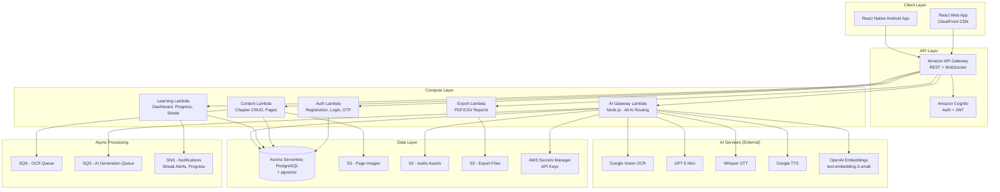
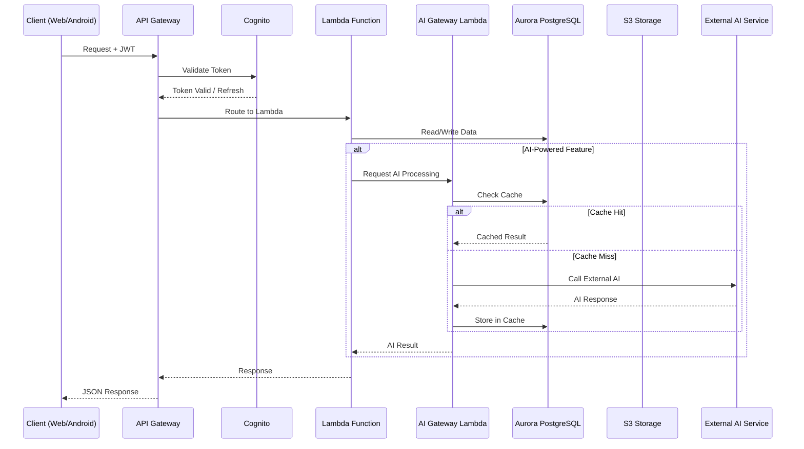
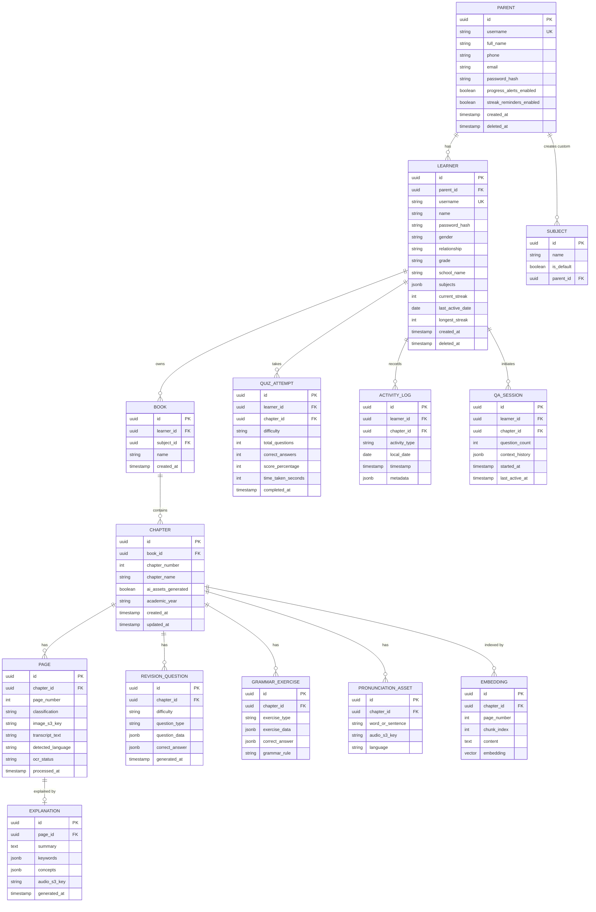

# Design Document: ChikuMiku LearnVerse

## Overview

ChikuMiku LearnVerse is a subject-agnostic AI-powered learning platform for students from LKG to 12th Grade. The system enables textbook digitization via OCR, AI-powered explanations, pronunciation practice, grammar exercises, chapter-based Q&A, revision quizzes, and progress tracking — all within a parent-monitored environment.

The architecture follows a serverless-first approach on AWS, using a shared AI Gateway (Node.js Lambda) that routes all LLM/AI calls through a single service layer for cost control and caching. The platform targets Android 8.0+ (React Native) and modern web browsers (React), with offline-first capabilities for learners.

### Key Design Decisions

1. **Single AI Gateway**: All AI calls (GPT-5 Mini, Whisper, Google Vision OCR, Google TTS, OpenAI Embeddings) route through one Node.js Lambda service for unified rate limiting, caching, and cost tracking.
2. **Generate-Once-Serve-Forever**: AI-generated assets (summaries, questions, pronunciation audio, explanations) are generated once per chapter and cached permanently in S3/Aurora, reducing LLM costs by ~70%.
3. **RAG over Full-Context**: Q&A uses pgvector to retrieve top-5 relevant paragraphs rather than sending entire chapters to the LLM.
4. **Rule-Based Analytics**: Progress tracking, weak-area detection, and recommendations use deterministic rules — no LLM involvement.
5. **Offline-First for Learners**: Chapter transcripts, explanations, and exercises are persisted locally for offline access with background sync on reconnection.

## Architecture



### Request Flow



## Components and Interfaces

### 1. Authentication Service (Auth Lambda)

**Responsibilities**: Parent/Learner registration, login, password reset, OTP management, account lockout.

```typescript
// API Endpoints
POST /auth/register/parent       // Parent registration
POST /auth/register/learner      // Learner registration (authenticated parent)
POST /auth/login                 // Login with role selection
POST /auth/forgot-password       // Initiate OTP reset
POST /auth/verify-otp            // Verify OTP
POST /auth/reset-password        // Set new password after OTP
POST /auth/logout                // Terminate session
POST /auth/verify-password       // Re-authentication for sensitive actions

// Interfaces
interface ParentRegistrationRequest {
  username: string;       // 8-15 chars, [a-z0-9_-]
  fullName: string;       // 5-20 chars, [a-zA-Z ]
  phone: string;          // exactly 10 digits
  email: string;          // valid email, max 30 chars
  password: string;       // 8-20 chars, 1 upper, 1 lower, 1 digit, 1 special
}

interface LearnerRegistrationRequest {
  parentUsername: string;  // pre-filled, read-only (from authenticated session)
  username: string;        // 8-15 chars, [a-z0-9_-]
  name: string;            // 5-20 chars, [a-zA-Z ]
  password: string;        // 8-20 chars, 1 upper, 1 lower, 1 digit, 1 special
  gender: 'male' | 'female' | 'other';
  relationship: 'son' | 'daughter' | 'other';
  grade: string;           // LKG through Twelfth
  schoolName: string;      // 5-30 chars, [a-zA-Z0-9, -]
  subjectIds: string[];    // min 1 subject required
  customSubjects?: string[]; // 1-50 chars each, max 5 per learner
}

interface LoginRequest {
  role: 'parent' | 'learner';
  username: string;
  password: string;
}

interface ValidationResult {
  valid: boolean;
  errors: Record<string, string>;  // field -> error message
}
```

### 2. Content Ingestion Service (Content Lambda)

**Responsibilities**: Chapter CRUD, page image management, OCR orchestration, transcript storage.

```typescript
// API Endpoints
POST /content/chapters                    // Create chapter
GET  /content/chapters/:id                // Get chapter details
PUT  /content/chapters/:id/transcript     // Save/edit transcript
POST /content/chapters/:id/pages          // Upload page images
POST /content/chapters/:id/process        // Trigger OCR processing
GET  /content/subjects/:subjectId/books   // List books for subject

// Interfaces
interface ChapterCreateRequest {
  subjectId: string;
  bookName: string;         // 3-50 chars, [a-zA-Z0-9 :-]
  chapterNumber: number;    // 1-999
  chapterName: string;      // 3-100 chars, [a-zA-Z0-9 :-]
}

interface PageUpload {
  imageData: Buffer;
  format: 'jpeg' | 'png' | 'heic';
  sizeBytes: number;        // max 10MB
  pageOrder: number;
  classification: 'content' | 'exercise';
}

interface TranscriptPage {
  pageNumber: number;
  classification: 'content' | 'exercise';
  text: string;
  language: string;         // auto-detected
}
```

### 3. AI Gateway Service (AI Gateway Lambda)

**Responsibilities**: Route all AI requests, manage caching, cost tracking, rate limiting. Single entry point for all external AI services.

```typescript
// API Endpoints (internal, called by other Lambdas)
POST /ai/ocr                    // Google Vision OCR
POST /ai/explain                // Generate page explanations
POST /ai/qa                     // Chapter Q&A with RAG
POST /ai/grammar                // Generate/evaluate grammar exercises
POST /ai/revision               // Generate revision questions
POST /ai/pronunciation/audio    // Generate TTS audio
POST /ai/pronunciation/score    // Score pronunciation via Whisper
POST /ai/embed                  // Generate embeddings for content

// Interfaces
interface AIRequest {
  type: 'ocr' | 'explain' | 'qa' | 'grammar' | 'revision' | 'tts' | 'stt' | 'embed';
  chapterId: string;
  payload: Record<string, unknown>;
  learnerId: string;
  gradeLevel: string;
}

interface CacheCheckResult {
  cached: boolean;
  data?: unknown;
  cacheKey: string;
}

interface ExplanationResult {
  pageNumber: number;
  summary: string;          // max 200 words
  keywords: string[];       // 3-10 items
  concepts: string[];       // 1-5 items
  audioUrl?: string;        // S3 pre-signed URL
}

interface PronunciationScore {
  overallScore: number;     // 0-100
  syllables: SyllableResult[];
}

interface SyllableResult {
  text: string;
  accuracy: number;         // 0-100
  color: 'green' | 'yellow' | 'red';  // >=80, 40-79, <40
}

interface QARequest {
  chapterId: string;
  question: string;         // 1-500 chars
  sessionContext: string[]; // up to 20 prior Q&A pairs
  gradeLevel: string;
}

interface RAGContext {
  paragraphs: string[];     // top 5 relevant paragraphs
  similarity_scores: number[];
}
```

### 4. Learning Service (Learning Lambda)

**Responsibilities**: Dashboard data, progress tracking, streak management, analytics (rule-based).

```typescript
// API Endpoints
GET  /learn/dashboard/parent           // Parent dashboard tree data
GET  /learn/dashboard/learner          // Learner dashboard tree data
GET  /learn/progress/:learnerId        // Progress summary
POST /learn/activity                   // Record qualifying activity
GET  /learn/streak/:learnerId          // Get current streak
GET  /learn/recommendations/:learnerId // Rule-based recommendations

// Interfaces
interface StreakData {
  currentStreak: number;
  lastActiveDate: string;    // ISO date (device-local)
  longestStreak: number;
}

interface ProgressPercentage {
  chapterCompletion: number;    // (pagesRead / totalPages) * 100
  exerciseCompletion: number;   // (answered / total) * 100
}

interface DashboardTreeNode {
  id: string;
  type: 'learner' | 'subject' | 'book' | 'chapter' | 'exercise' | 'quiz';
  name: string;
  completionPercentage: number;
  children?: DashboardTreeNode[];
}

interface ActivityRecord {
  learnerId: string;
  activityType: 'read' | 'exercise' | 'quiz' | 'pronunciation';
  chapterId: string;
  timestamp: string;
  localDate: string;         // learner's device-local date
}
```

### 5. Export Service (Export Lambda)

**Responsibilities**: Generate PDF/CSV progress reports for parents.

```typescript
POST /export/report    // Generate and return download URL
GET  /export/:id       // Download generated report

interface ExportRequest {
  parentId: string;
  format: 'pdf' | 'csv';
  learnerIds?: string[];    // all learners if omitted
}
```

### 6. Notification Service (SNS Integration)

**Responsibilities**: Streak alerts, progress notifications to parents.

```typescript
interface NotificationPayload {
  type: 'streak_alert' | 'progress_update' | 'streak_reminder';
  recipientId: string;
  channel: 'push' | 'email';
  data: Record<string, unknown>;
}
```

### 7. Client-Side Modules

#### Validation Module (Shared Web + Mobile)

```typescript
// Pure functions — no side effects, testable as properties
interface FieldValidator {
  validateUsername(input: string): ValidationResult;
  validateFullName(input: string): ValidationResult;
  validatePhone(input: string): ValidationResult;
  validateEmail(input: string): ValidationResult;
  validatePassword(input: string): ValidationResult;
  validateBookName(input: string): ValidationResult;
  validateChapterName(input: string): ValidationResult;
  validateSubjectName(input: string): ValidationResult;
}
```

#### Offline Storage Module (Client)

```typescript
interface OfflineStore {
  persistChapter(chapter: ChapterData): Promise<void>;  // atomic
  getOfflineChapters(): Promise<ChapterData[]>;
  syncProgress(serverUrl: string): Promise<SyncResult>;
  getAcademicYearContent(year: number): Promise<ChapterData[]>;
}
```

#### Streak Calculator (Client + Server shared logic)

```typescript
interface StreakCalculator {
  calculateStreak(activityDays: string[]): number;
  shouldReset(lastActiveDate: string, currentDate: string): boolean;
  shouldIncrement(activityDays: string[], currentDate: string): boolean;
}
```

## Data Models

### Entity Relationship Diagram



### Key Data Design Decisions

1. **pgvector for embeddings**: Store chapter content embeddings directly in Aurora PostgreSQL using the pgvector extension. Each page is split into chunks (~500 tokens), embedded with `text-embedding-3-small`, and stored for RAG retrieval. No separate vector database needed at this scale.

2. **Soft deletion**: Parent and Learner records use `deleted_at` timestamp for soft delete. Data scheduled for permanent deletion after 30 days per privacy requirements.

3. **Academic year partitioning**: Chapters tagged with `academic_year` derived from learner grade at creation time. Prior-year content becomes read-only archive.

4. **JSON columns**: `subjects` (learner), `question_data`, `correct_answer`, `context_history` use JSONB for flexible schema while maintaining queryability.

5. **Denormalized streak**: `current_streak` and `last_active_date` stored directly on Learner record for fast dashboard reads. Activity log provides source of truth for recalculation if needed.

6. **AI asset flags**: `ai_assets_generated` on Chapter enables cache-first pattern. When transcript is edited, this flag resets to trigger regeneration.

## Correctness Properties

*A property is a characteristic or behavior that should hold true across all valid executions of a system — essentially, a formal statement about what the system should do. Properties serve as the bridge between human-readable specifications and machine-verifiable correctness guarantees.*

### Property 1: Field Validation Correctness

*For any* input string and any field type (username, full name, phone, email, password, book name, chapter name, subject name), the field validator SHALL accept the string if and only if it conforms to the field's defined format rules (character set, length bounds, and pattern requirements), and reject it with an appropriate error message otherwise.

**Validates: Requirements 1.1, 1.3, 2.1, 2.5, 4.2, 6.1, 16.2, 16.3, 17.2, 17.7**

### Property 2: Streak Calculation Consistency

*For any* ordered sequence of calendar dates representing learner activity days, the streak calculator SHALL produce a streak count that: (a) increments by exactly 1 for each consecutive active day or single-gap day, (b) resets to 0 when 2 or more consecutive calendar days have no activity, and (c) never decreases during a run of consecutive active days.

**Validates: Requirements 5.1, 5.2, 5.3**

### Property 3: File Upload Validation

*For any* file with a given format identifier and size in bytes, the file validator SHALL accept the file if and only if the format is one of {JPEG, PNG, HEIC} AND the size is ≤ 10,485,760 bytes, and SHALL return the correct rejection reason (unsupported format or file too large) otherwise.

**Validates: Requirements 7.2, 7.3**

### Property 4: Transcript Page Organization

*For any* set of pages with page numbers and content/exercise classifications, the transcript organizer SHALL produce output where: (a) all pages have sequential page markers, (b) content pages are grouped separately from exercise pages, and (c) the original text content of each page is preserved exactly.

**Validates: Requirements 8.4**

### Property 5: Explanation Structure Constraints

*For any* generated explanation for a page, the output SHALL contain: (a) a summary of at most 200 words, (b) between 3 and 10 keywords inclusive, and (c) between 1 and 5 concepts inclusive.

**Validates: Requirements 9.1**

### Property 6: Page Navigation Boundary Controls

*For any* chapter with N pages (N ≥ 1) and current page index P (1 ≤ P ≤ N), the Previous button SHALL be disabled if and only if P = 1, and the Next button SHALL be disabled if and only if P = N.

**Validates: Requirements 9.5**

### Property 7: Pronunciation Scoring and Color Classification

*For any* pair of (expected text, transcribed text), the pronunciation scorer SHALL produce: (a) an overall accuracy score between 0 and 100 inclusive, and (b) per-syllable color codes where green is assigned for accuracy ≥ 80, yellow for accuracy in [40, 79], and red for accuracy < 40.

**Validates: Requirements 10.4, 10.5**

### Property 8: Practice Item Count Bounds

*For any* chapter with sufficient content, a pronunciation practice session SHALL present between 5 and 20 words or sentences inclusive extracted from the chapter content.

**Validates: Requirements 10.3**

### Property 9: Grammar Exercise Generation Bounds

*For any* chapter transcript with sufficient content, the grammar engine SHALL generate between 5 and 10 exercises inclusive. For chapters with insufficient content: if 2-4 exercises can be generated, a "limited content" message SHALL be displayed; if exactly 1 exercise is generated, no such message SHALL be displayed.

**Validates: Requirements 11.3, 11.7**

### Property 10: Exercise Score Calculation

*For any* set of exercise answers where N is the total count and C is the correct count (0 ≤ C ≤ N, N ≥ 1), the score percentage SHALL equal floor((C / N) × 100).

**Validates: Requirements 11.6**

### Property 11: Question Length Constraint Validation

*For any* question string submitted to the Q&A engine, if the string length exceeds 500 characters, the system SHALL reject it before any AI processing is attempted and return a constraint violation message.

**Validates: Requirements 12.6**

### Property 12: Revision Quiz Timer Validation

*For any* timer value T submitted for a revision session, the system SHALL accept T if and only if T is a multiple of 5 AND 5 ≤ T ≤ 120.

**Validates: Requirements 13.3**

### Property 13: Progress Tracking Aggregation

*For any* sequence of quiz attempts for a chapter, the system SHALL correctly maintain: (a) attempt count equal to the total number of completed attempts, (b) highest score equal to the maximum score_percentage across all attempts, and (c) most recent score equal to the score_percentage of the chronologically last attempt.

**Validates: Requirements 13.10, 14.3**

### Property 14: Parent Dashboard Completion Percentage

*For any* chapter with total pages T (T ≥ 1) and pages read R (0 ≤ R ≤ T), the parent dashboard SHALL display completion percentage as floor((R / T) × 100). For exercises with total questions Q and correct answers A, exercise completion SHALL be floor((A / Q) × 100).

**Validates: Requirements 14.1**

### Property 15: Learner Dashboard Completion Percentage

*For any* chapter with total content pages T (T ≥ 1) and pages read R (0 ≤ R ≤ T), the learner dashboard SHALL display completion percentage as round((R / T) × 100) to the nearest integer. Pages Left SHALL equal T - R. Pages Done SHALL equal R.

**Validates: Requirements 15.1, 15.2**

### Property 16: JWT Token Validation

*For any* JWT token presented with an API request, the system SHALL reject the request if the token's expiration timestamp is in the past OR if the token signature is invalid, returning an authentication error.

**Validates: Requirements 20.7**

### Property 17: Grade-Based Font Size Selection

*For any* learner with a registered grade level, the platform SHALL return the correct minimum font size: 18px (mobile) / 20px (web) for LKG through 2nd Grade, 16px (mobile) / 18px (web) for 3rd through 5th Grade, and 14px (mobile) / 16px (web) for 6th through 12th Grade.

**Validates: Requirements 22.1**

### Property 18: AI Content Caching Logic

*For any* chapter, the system SHALL: (a) generate AI assets when the chapter transcript is first saved and `ai_assets_generated` is false, (b) serve cached assets without LLM invocation when `ai_assets_generated` is true and the transcript has not been modified, and (c) regenerate all AI assets and update the cache when a transcript is edited after assets were previously generated.

**Validates: Requirements 25.1, 25.2, 25.3**

### Property 19: Account Lockout Logic

*For any* username, the system SHALL lock the account for 15 minutes if and only if the consecutive failed authentication attempts equal or exceed 5. For attempt counts 1-4, authentication SHALL remain available.

**Validates: Requirements 3.5**

### Property 20: Academic Year Content Organization

*For any* learner with a given grade, all chapters created during the current academic year SHALL be accessible in read-write mode, and all chapters from prior academic years SHALL be accessible only in read-only archive mode.

**Validates: Requirements 21.4**

## Error Handling

### Error Handling Strategy

| Layer | Strategy | Example |
|-------|----------|---------|
| Client Validation | Inline field-specific errors, prevent submission | "Username must be 8-15 characters" |
| API Gateway | Standardized error response with HTTP status | 400 Bad Request, 401 Unauthorized, 429 Rate Limited |
| Lambda Functions | Try/catch with structured error logging | Return user-friendly message, log stack trace to CloudWatch |
| AI Gateway | Circuit breaker + retry with exponential backoff | If Google Vision fails, retry 3x then mark page as failed |
| Database | Transaction rollback on partial failure | Atomic operations for soft delete, chapter save |
| Offline Sync | Conflict resolution with server-wins strategy | Progress data merged, server timestamp takes precedence |

### Error Response Format

```typescript
interface APIError {
  statusCode: number;
  errorCode: string;          // machine-readable: 'VALIDATION_ERROR', 'AUTH_FAILED', etc.
  message: string;            // user-friendly message
  details?: Record<string, string>;  // field-specific errors for validation
  retryable: boolean;
  retryAfterSeconds?: number;
}
```

### Specific Error Scenarios

1. **OCR Failure**: Mark page as failed with error indicator on thumbnail. Provide retry button. Other pages unaffected.
2. **AI Generation Timeout**: Display timeout indication after 5 seconds. Preserve user data. Allow retry.
3. **Offline Sync Conflict**: Server-wins for progress data. Queue failed syncs for retry. Show sync indicator.
4. **Account Lockout**: 15-minute lockout after 5 failures. Generic error (no information leakage).
5. **OTP Expiry**: Invalidate after 3 incorrect attempts OR 5-minute timeout. Require new reset initiation.
6. **JWT Expiry**: Silent refresh via Cognito. If refresh fails, redirect to login without data loss.
7. **File Validation**: Immediate rejection with specific reason before upload begins.
8. **Atomic Persistence Failure**: If any component of chapter save fails, entire operation rolls back. User notified.

## Testing Strategy

### Dual Testing Approach

This project uses both unit/example-based tests and property-based tests for comprehensive coverage:

- **Unit tests**: Specific examples, edge cases, integration points, error conditions
- **Property-based tests**: Universal properties that hold across all valid inputs (validation, calculations, logic)

### Property-Based Testing Configuration

- **Library**: [fast-check](https://github.com/dubzzz/fast-check) (TypeScript/JavaScript)
- **Minimum iterations**: 100 per property test
- **Tag format**: `Feature: chikumiku-learnverse, Property {number}: {property_text}`

Each correctness property (Properties 1-20) maps to one property-based test. The property tests focus on pure logic functions that can be tested without external dependencies:

| Property | Target Module | What's Tested |
|----------|--------------|---------------|
| 1 | Validation Module | All field validators (username, name, phone, email, password, etc.) |
| 2 | Streak Calculator | Streak increment, reset, and maintain logic |
| 3 | File Validator | Format + size acceptance/rejection |
| 4 | Transcript Organizer | Page ordering, content/exercise separation |
| 5 | Explanation Validator | Output structure constraints |
| 6 | Navigation Controller | Button enable/disable boundary logic |
| 7 | Pronunciation Scorer | Score calculation and color classification |
| 8 | Practice Extractor | Item count within bounds |
| 9 | Grammar Generator | Exercise count and messaging logic |
| 10 | Score Calculator | Percentage computation |
| 11 | QA Input Validator | Length constraint pre-check |
| 12 | Timer Validator | Increment and range validation |
| 13 | Progress Aggregator | Attempt tracking, max/latest score |
| 14 | Parent Progress Calculator | Floor-based percentage |
| 15 | Learner Progress Calculator | Round-based percentage, pages left |
| 16 | Auth Middleware | JWT expiration and signature validation |
| 17 | Accessibility Config | Grade-to-font-size mapping |
| 18 | Cache Manager | Generate/serve/regenerate decision logic |
| 19 | Lockout Manager | Attempt counting and lock threshold |
| 20 | Academic Year Manager | Year determination and access mode |

### Unit / Example-Based Tests

Focus areas for traditional unit tests:
- Login/logout flow (role selection, session creation)
- OTP generation and verification workflow
- Landing page element presence
- Dashboard UI rendering with specific data scenarios
- Audio playback controls (play, pause, seek)
- Error message display (generic auth errors, field-specific validation)
- Responsive layout at breakpoints (360px mobile, 960px+ web)

### Integration Tests

- API Gateway → Lambda → Aurora round trips
- AI Gateway → External AI service calls (mocked in CI, real in staging)
- SQS message processing for OCR queue
- Cognito token issuance and validation
- S3 upload/download for images and audio
- Offline sync: record offline → reconnect → verify server state
- SNS notification delivery for streak alerts

### End-to-End Tests

- Full chapter creation flow: capture pages → OCR → save transcript → generate AI assets
- Complete learning session: read chapter → take exercise → pronunciation practice → revision quiz
- Parent monitoring flow: register → add learner → view progress dashboard
- Password reset flow: forgot → OTP → new password → login

### Performance Tests

- API response time < 2s at P95 with 500 concurrent users
- OCR processing < 15s per page at P95
- Explanation generation < 10s per page at P95
- Offline sync completes within 30 seconds of reconnection

### Security Tests

- TLS 1.2+ enforcement (reject older protocols)
- JWT expiration and refresh flow
- Password hashing verification (bcrypt cost ≥ 10)
- Session token storage (httpOnly, secure flags)
- Re-authentication requirement for sensitive actions
- No PII leakage in error messages (generic auth errors)
- No third-party tracking SDK verification

